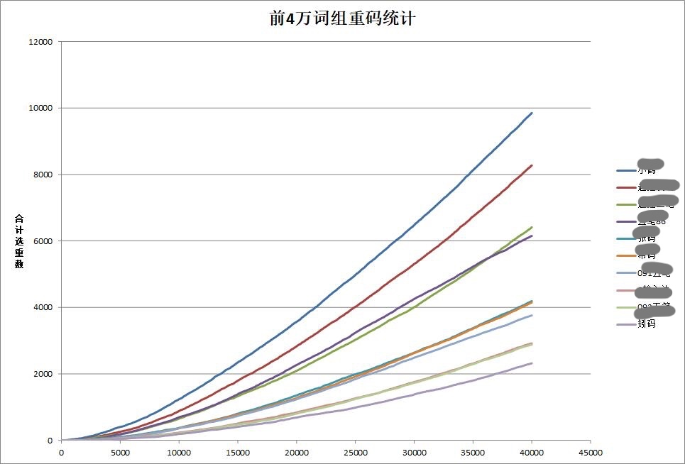
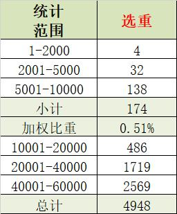
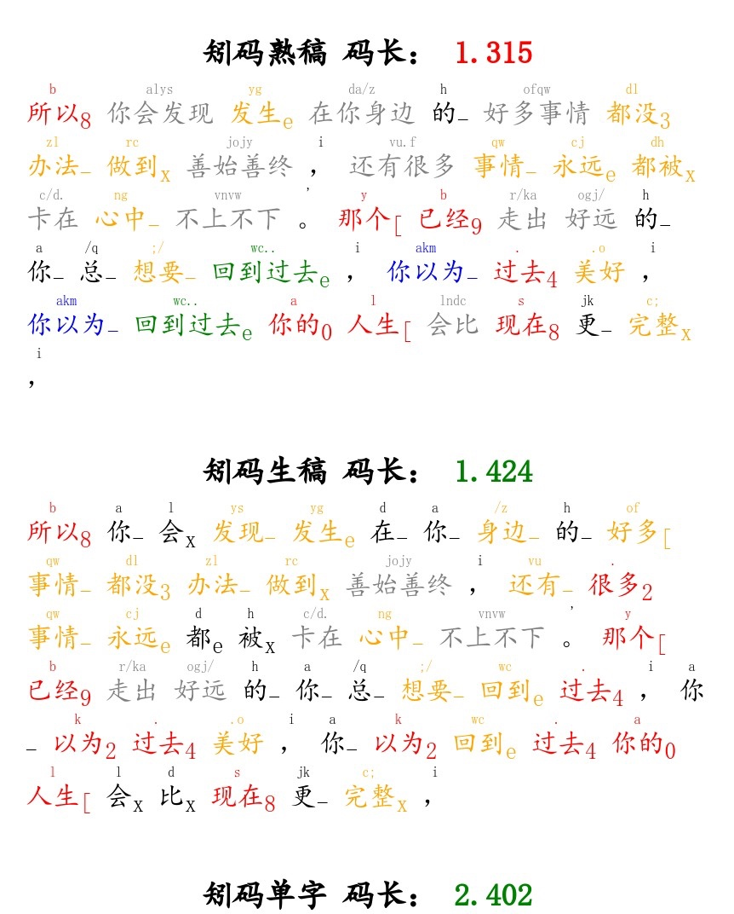

# 矧码实战教学(SM demystified)
矧(shěn)码，又名神码。

在很多人心中，矧码是可望不可及的存在。它让人心怀神往，同时又望而生畏。而在有的人心中，它不过是靠“大词库”+“多选重”搞出来的快餐方案，没什么了不起的。还有一些人，可能已经拿到了矧码的字根表，但是看着密密麻麻字根，心中却难免升起了无助感，最终选择放弃。

本教学并不能化腐朽为神奇，我只是相信：有勇气学矧码的人寥寥无几，但是有能力学矧码的人却大有人在。没有勇气，不代表没有能力。希望我的教学可以帮助那些对矧码有兴趣，有决心，却没有足够信心的朋友。让他们获得足够的决心和勇气，去真正的把矧码学好！

如果只是抱着试一试态度的人，我在这里对你进行劝退：“你是学不好的，学习矧码只会浪费你的时间。希望你能找到其它更适合你的方案，再见！” 

如果你有决心，只是少了勇气。那么在这个教程中，我将揭开矧码的神迷面纱。正式向你介绍这款优秀的形码方案，让你对它有更深的认识。并且，如果我有幸能使你对矧码产生更大的兴趣，我将尽我所能，在本教学中带你更快、更轻松的走入矧码的世界。
## 一、矧码有多难？
不知道你是否曾听过这样一句话：“矧码是神学的。”

可以说，矧码的**难**是“臭名昭著”的，您可能或多或少都已经听过了这个特点。但是在这里，我想为矧码正名：它确实比较难，但是可能并不是你想象中的那么难。甚至，在某些方面，它比很多“最简单”的方案，更加简单易学。

**矧码，是人学的。**而且，是每个人都可以学会的。只要你有足够的决心，和付出一定的时间，就一定可以学会矧码。如果你曾认为矧码一定不适合你，希望这一章可以改变你的看法，并让你能够客观的决定是否选择学习矧码。

###入门仅需270个字根
首先，矧码确实有近600字根。但事实上，你并不需要完全掌握它们。矧码的学习，并不是背完全部的字根才能打字。入门的话，你可能只需要背完270个字根，就可以打前500个常用字。再辅以轻度的反查功能，就可以进行日常的聊天水群了。

在此基础上，多记82个根，就可以打中500。然后再多记56个字根，即可把前1500都打全。如果要打前3500个常用字，需要背多少根呢？只要在原先的基础上多背60个字根就可以了。可以说，矧码越学到后面，字根的性价比就越高！学习的回报就越大。

| 常用字   | 新增字根 | 多学一个字根可以多打 |
|-------|------|----------|
| 0-500 |   270   |     1.85字     |
| 500-1000 |   82   |     6.09字     |
| 1000-1500 |   56   |     8.92字     |
| 1500-3500 |   60   |     33.3字     |

矧码有很多的字根，主要是为了让它在进行生僻字、繁体字的输入中，也可以有很优秀的表现。但是，如果你不是一个生僻字、繁体字的重度用户，你为什么要被这些不用背的字根吓退呢？事实上，分级字根表早就被整理出来了，你可以按需要进行学习。就算你永远不把矧码的所有字根背完（就像我只记了300个字根)，也不影响你的[提速](https://tieba.baidu.com/p/7060929251)。

## 二、矧码的性能如何？
一个方案的性能，主要就是指它的码长，也就是指平均敲多少下键可以打出一个字。而矧码最大的、最直视的特点，应该就是它的**码长非常短**。

那么，码长是如何降低的呢？有的人可能会说，可以通过多个选重（比如9重）；还有的人可能会说，可以通过大词库里的长词、短句。只要不考虑难度，就可以大大的缩短码长。但是，每个方案都可以采用这些技巧。如果每个方案都是最多的选重、最大的词库，怎么区分出谁更优秀呢？这样就无法区分了。

因此，方案如果要真正的区分差距，就要在相同选重、相同词库下，比较**“离散程度”**。我们来举个例子：我们有4个字，4个编码的空间。如果只用一个编码空间，将所有的字都放进一个编码里，那么我们的平均码长就是4。但是，如果我们将所有的编码空间都用上，并且平均的在每一个空间里放一个字，那么我们的平均码长就是1。由此可见，**充分利用编码的空间**，就可以真正的降低重码率、缩短码长。

码长短，往往也代表了这个方案的重码率会更低。因为码长短，意味着对编码空间充分利用，而编码空间的充分利用、平均分布，就代表了每个编码空间里的字词是相对较少的，也就是说**重码率会更低**。可无论是“重码率”，还是“离散性”，这些概念其实都并不直观。为了可以更直观的来解释这个概念，我们可以看看下面这个性能测试的小游戏：

在一个接近无限大的词库中（完全没有记忆的可能），任选一个词。我们要最快的把这个词打出来。那么我们有两个策略：1、按规则打出编码之后，看候选表然后选择正确的词。2、赌这个词是首选，直接打编码，然后上屏。

第一个策略是相对稳妥的，可以有比较快的速度。但是，对于一些性能较好的方案，可能就并不划算了。因为性能较好的方案，能够保证大多数的常用词都在首选，直接打首选词可以最大程度的节省时间。会有少量的词不是首选，回改会花费大量的时间，但是由于非首选词相比首选词要少很多。因此，哪怕回改后拆成单字来打，对于高性能方案来说，赌一个词是首选的策略依然会带来更高的输入速度。

从上面的图表的结果可以看出，矧码的重码率，在与其它方案的对比中，表现出了非常低的重码率。也就是说，如果上面的这些方案一起打赌，一个未知的词是不是首选，矧码获胜的概率是非常高的。

### “见词就打”的矧码 

上面的图表告诉我们，矧码的重码率是经得起比较的。那么它具体是怎么样的呢？我们可以看看这张图。

我们可以看到，在前10000常用词的统计中，选重的词组只有174组。经过加权后，仅有0.51%。也就是说，在日常生活中最常使用的10000词，只有0.51%的情况下会需要选重。这个数据是不是可以让你更加相信，矧码在大多数情况下可以“见词就打”？

看起来选重很多的矧码，无法确定的选重其实非常少。按照规则去打一个全码词，几乎是不需要看候选框的，因为在非常大的概率下，这个词会是首选。如果碰巧不是，也不要慌，回改也是打字的一部分，将打错的字删掉拆单打即可。

有很多人认为，矧码虽然码长短，但是主要是因为他有很多的长词和短句。其实，矧码即使不打长词与短句，在打生稿的过程中，依然有非常强的优势。在“常用词组重码”的统计中，生僻词、长词、短句都对结果不会造成实际的影响。事实上，如果你所在的跟打群中有“小R”机器人，你可以直接用“*s [你要查询的文章]*”来使用小R机器人查询矧码的生稿码长。

可以看到，矧码的“熟稿”会有*“回到过去”*、*“还有很多”*这样的词。你可能会觉得，这些词你根本不会打，这就代表1.3的码长是失真的。当你真的用矧码打字，矧码其实和其它方案没有什么不同。我很同意矧码的熟稿码长会失真，所以我做了矧码的“生稿”码长的计算。在“生稿码长”中，除了矧码的“简词”，生稿并不会使用任何生僻词、长词，或者短句，它更加接近大多数人正常的分词思路。可以看到，矧码的生稿的码长的确有所增长，变成了1.4。

## 三、怎么学矧码？

讲到这里，我其实很想与你分享矧码的设计理念，让你可以更好的理解矧码的制作工艺。但是，矧码的学习是个长期的过程。最快的上手并开始打字，是最好的了解矧码的方式。因此，让我们开始学习吧！

### 矧码的字根表
很多人开始学矧码，首先就是找矧码的字根表。这其实是可以理解的，因为大多数的形码方案，最直接的上手方式就是使用字根表。但是，矧码和其它的方案不同。对于矧码来说，使用字根表来学习是事倍功半的。这主要有**两个原因**：
1. 矧码的字根表没有过滤，所有的字根都挤在一起，直接看是根本记不下来的，只会让你望而生畏，徒增烦恼。
2. 矧码有标准化的学习流程，以及配套的专业练习工具，完全可以替代传统低效的学习方式，帮你更快、更好的掌握矧码。

### 矧码的学习步骤
想要学习矧码，首先自然是需要知道矧码的学习有哪些段位，然后再按步就班的去练习，力求进步到下一个段位。

有些人可能觉得分段是没有必要的，但我个人却不这么认为：如果不分段，可能大多数人的学习都会半途而废。想象一下，如果你从幼儿园开始，上学就不分年级，只是一直上学，上学，再上学，那该是多么恐怖的一件事情。你不知道自己学了多久，也不知道自己还要学多久。往回看，没有成就感，往前看，没有盼头。虽然我们说学习是无止境的，但是对大多数人来说，比起一个永远完不成的任务，一个个不断更新的“小目标”是更加容易接受和实现的。

大体的来说，矧码分为入门、熟练、小成、大成、大圆满五个学习的阶段。对于大多数人来说，只要达到“熟练”的程度，就可以胜任生活中绝大多数的打字任务了。矧码诞生于2020年8月底，截止至今天（2020年12月15日），矧码**诞生四个月不到**，目前就已经有人可以将100字熟稿的速度冲到**350+**，也有人已经能够做到一些特定的水文可以首打**180+**。虽然说还没有人达到“小成”的水平，但是这至少证明：矧码虽然难，可只要你下苦功，就一定会有回报。

各个段位的具体练习内容如下。
1. **入门**：主要是了解规则，背字根（根据需求，最少背270个字根），结合反查可以日常聊天。掌握小部分最常用的简词，前500单字乱序80+。
2. **熟练**：前500单字乱序120+，掌握所有的常用简词，水文首打180+，难文120+。
3. **小成**：前1500乱序6击+。掌握大部分简词，水文首打240+。难文首打在180+。
4. **大成**：随手8击+，掌握全部简词，水文首打340+。难文首打210+。
5. **大圆满**：随手10击+，水文首打420+，难文300+。

### 矧码的“入门”阶段该做什么？
注：以下所有提到的工具，都可以在矧码官方QQ群（461618919）中下载。
#### 背270+字根
1. **使用矧码字根练习工具**
在矧码的入门阶段，你首先可以做的就是使用“简陋字根练习工具”来背字根。注意，不要被工具的名字骗了。虽然叫“简陋工具”，但是这个工具并不简陋，它自带有字根调频的功能，错的多的字根会被更多的重复。我后来用了很多专业的记忆工具，但是记来记去，发现只有用“简陋字根练习工具”背的字根是记得最牢固的。在这个环节，你最好可以多背一些字根，背得越多，你的基本功就越好。在矧码被简化之前，大佬们都是在这个环节背完所有的近600个字根。因此第一代的矧码大佬们，也拥有最强的基本功。如果你的记忆天赋超群，可以尝试在这个环节背完所有的字根。
2. **使用字根辅助记忆工具**
当你在第一个环节陷入了瓶颈，记字根的速度越来越慢，记得越来越吃力，可以考虑使用字根辅助力记忆工具来进行记忆。这个工具的优点在于他可以帮你在一到两天内完成100-200个字根的速记。但是缺点也很明显，如果你没有很大的练习量，用这种方式记住的字根很快就会被忘的一干二净。

#### 练前500单字
1. **使用ghcm.fun**
在前500单字练习的前期，推荐使用矧码的专用单字练习网站[http://ghcm.fun](http://ghcm.fun)。当你对矧码有所了解之后，你应该可以很快反应过来。“ghcm”就是“矧码”这个词在矧码中的编码。由于这个网站访问的服务器在国外，因此加载的速度可能会有点慢，请耐心等待。
2. **使用单字练习工具**
如果你觉得ghcm.fun出新的字太慢，你也可以使用“单字练习工具”。这个工具可以以更快的速度出新的单字，但是就像“字根辅助记忆工具”一样。更快的速度意味着更容易忘，所以如果不是ghcm.fun出新的字实在太慢，最好还是坚持用ghcm.fun来练习前500。

#### 接触简词
1. **所有的一简简词**：如“我们”，“你们”，“他们”，“不是”，“吗？”等等。
2. **部分最常用的二简**：如“不知道”，“我们的”等。

## 270字根速记表

| 序号 | 字根 | 编码 | 联想 | 相关字（前500） |
|----|----|----|----|-----|
| 1 | 亻 | rb | 日本 若不 让步 | 住什传何们代依体化低信做任候像位似作使便保件 |
| 2 | 讠 | tb | 特别 淘宝 逃避 同伴 天边 | 语证请议记计识谈认许话论调该设 |
| 3 | 口 | ql | 起来 权利 起了 权力 强烈 | 如知吃听口响台问虽叫员名呢 |
| 4 | 氵 | lu | 路 陆 卢 露 鲁 | 活注清江治没深满消法流 |
| 5 | 日 | kp | 恐怕 可怕 开辟 卡片 靠谱 | 显日间最照易电是早明 |
| 6 | 扌 | pv | 颇为 陪我 品味 平稳 盼望 | 推报接据把持拉提指找 |
| 7 | 宀 | cv | 成为 错误 窗外 从未 财务 | 安容定完实它官客家字 |
| 8 | 一 | js | 就是 建设 就算 接受 精神 | 更无一严百正元 |
| 9 | 木 | ;r | 夫人 法人 妇人 繁荣 否认 | 根相样李格机极 |
| 10 | 纟 | yv | 因为 以为 一位 业务 宇文 | 约经红终结统绝 |
| 11 | 阝 | tm | 他们 它们 她们 甜蜜 透明 | 除部阳院随 |
| 12 | 禾 | fc | 非常 发出 付出 方才 风吹 | 和利种称程 |
| 13 | 大 | zs | 只是 这是 总是 真是 则是 | 类因大美达 |
| 14 | 门 | nv | 那位 女王 难忘 内外 凝望 | 间们问门闻 |
| 15 | 艹 | dr | 的人 当然 大人 敌人 陡然 | 花若落英节 |
| 16 | 匕 | ul | 为了 未来 无论 忘了 网络 | 此它老死呢 |
| 17 | 丷 | /u | 古 故 顾 骨 谷 | 关单总半商 |
| 18 | 彳 | .d | 得到 到底 等待 党的 懂得 | 德待往微很 |
| 19 | 竹 | vf | 无法 王妃 违反 违法 王府 | 笑第管算答 |
| 20 | 人 | lr | 两人 老人 令人 例如 利润 | 人个众全 |
| 21 | 女 | ol | 为了 未来 无论 忘了 网络 | 她如女始 |
| 22 | 辶 | gr | 个人 果然 感染 给人 工人 | 连达进过 |
| 23 | 月 | ba | 把 吧 八 本案 巴 | 月期服明 |
| 24 | 子 | go | 给我 跟我 更为 过往 国王 | 子李学字 |
| 25 | 王 | sr | 虽然 三人 收入 深入 使人 | 现理全王 |
| 26 | 车 | uo | 我 握 窝 沃 卧 | 连转车轻 |
| 27 | 冫 | af | 安抚 案发 | 决准况次 |
| 28 | 艮 | dt | 点头 低头 冬天 大厅 代替 | 跟根眼很 |
| 29 | 夂 | df | 对方 地方 对付 东方 巅峰 | 备务条处 |
| 30 | 弓 | hw | 化为 毫无 货物 还未 华为 | 张强引费 |
| 31 | 牛 | y; | 依法 一份 衣服 一副 一方 | 特制物件 |
| 32 | 立 | uf | 无法 王妃 违反 违法 王府 | 位拉立站 |
| 33 | 白 | hh | 好好 很好 缓缓 后悔 呵呵 | 的白百 |
| 34 | 土 | .f | 对方 地方 对付 东方 巅峰 | 场坐城 |
| 35 | 目 | fs | 发生 方式 分手 放松 放手 | 相眼目 |
| 36 | 又 | hz | 或者 孩子 还在 合作 活着 | 观又难 |
| 37 | 己 | bz | 不再 不知 帮助 保证 保障 | 已改己 |
| 38 | 里 | /c | 刚才 观察 工程 过程 棺材 | 量重里 |
| 39 | 刂 | aa | 暗暗 | 别刚则 |
| 40 | 忄 | wj | 我就 忘记 玩家 文件 无极 | 性快情 |
| 41 | 十 | wp | 物品 外婆 我怕 无匹 五品 | 真十南 |
| 42 | 云 | nd | 你的 您的 年的 难道 脑袋 | 动云运 |
| 43 | 止 | dv | 单位 队伍 地位 动物 耽误 | 此正步 |
| 44 | 广 | ny | 你要 那样 难以 农业 浓郁 | 度底应 |
| 45 | 囗 | vz | 望着 位置 文字 文章 物质 | 图国因 |
| 46 | 亠 | gh | 更好 公会 规划 过后 刚好 | 市变商 |
| 47 | 厶 | av | 安慰 爱我 安稳 | 台公么 |
| 48 | 见 | ar | 爱人 安然 黯然 傲然 矮人 | 观见现 |
| 49 | 米 | a. | 爱的 爱得 安定 黯淡 暗淡 | 精数类 |
| 50 | 足 | sy | 所以 所有 使用 声音 属于 | 足跟路 |
| 51 | 夕 | mr | 没人 猛然 每日 面容 茫然 | 外罗名 |
| 52 | 攵 | bk | 包括 不可 不肯 崩溃 不堪 | 故放收 |
| 53 | 士 | /k | 顾客 公开 感慨 高考 赶快 | 志声士 |
| 54 | 八 | ms | 面色 马上 没事 模式 民事 | 父八公 |
| 55 | 巾 | fr | 夫人 法人 妇人 繁荣 否认 | 布市常 |
| 56 | 丶 | ow | 微微 往往 问我 万物 我问 | 术义 |
| 57 | 小 | bp | 不怕 奔跑 背叛 被迫 不配 | 小当 |
| 58 | 中 | gd | 规定 过的 感到 孤独 更多 | 种中 |
| 59 | 去 | .a | 大 打 答 答案 达 | 去法 |
| 60 | 自 | fw | 服务 范围 房屋 分为 废物 | 息自 |
| 61 | 心 | nc | 拿出 农村 那次 那场 年初 | 思心 |
| 62 | 可 | wq | 完全 委屈 武器 无情 望去 | 何可 |
| 63 | 丨 | md | 面对 矛盾 目的 猛地 每当 | 已个 |
| 64 | 以 | kf | 客服 开放 开发 咖啡 克服 | 似以 |
| 65 | 羊 | jr | 竟然 进入 既然 居然 今日 | 样着 |
| 66 | 力 | zv | 作为 自我 这位 周围 之外 | 办力 |
| 67 | 生 | gp | 公平 股票 个屁 古朴 | 生性 |
| 68 | 从 | hu | 胡 虎 乎 湖 呼 | 两从 |
| 69 | 开 | sl | 上了 实力 手里 死了 审理 | 形开 |
| 70 | 龶 | oz | 欧洲 | 表青 |
| 71 | 只 | fl | 法律 发了 分离 分类 疯了 | 识只 |
| 72 | 工 | ov | 微微 往往 问我 万物 我问 | 功工 |
| 73 | 其 | hr | 忽然 赫然 骇然 坏人 轰然 | 期其 |
| 74 | 方 | jq | 加强 进去 坚强 及其 将其 | 方放 |
| 75 | 丿 | bk | 包括 不可 不肯 崩溃 不堪 | 系么 |
| 76 | 田 | g/ | 刚刚 改革 哥哥 尴尬 各个 | 界思 |
| 77 | 斤 | nr | 女人 男人 内容 懦弱 纳入 | 近听 |
| 78 | 合 | qv | 千万 请问 期望 前往 权威 | 合答 |
| 79 | 音 | w. | 我的 问道 伟大 稳定 温度 | 意音 |
| 80 | 石 | cf | 吃饭 充分 重复 财富 出发 | 石确 |
| 81 | 几 | kl | 快乐 看了 看来 考虑 开来 | 机几 |
| 82 | 𠃌 | pz | 胖子 批准 品质 趴在 潘子 | 司成 |
| 83 | 走 | r/ | 如果 若干 人格 人工 绕过 | 越走 |
| 84 | 隹 | ;u | 福 傅 佛 夫 富 | 集难 |
| 85 | 殳 | vp | 物品 外婆 我怕 无匹 五品 | 没设 |
| 86 | 礻 | hj | 回家 环境 很久 痕迹 黄金 | 视神 |
| 87 | 𠂇 | sb | 身边 失败 随便 手臂 上班 | 布友 |
| 88 | 长 | pr | 派人 旁人 譬如 仆人 平日 | 张长 |
| 89 | 穴 | nj | 年纪 凝聚 宁静 南京 你家 | 空究 |
| 90 | 𰃮 | mg | 目光 美国 每个 某个 敏感 | 学觉 |
| 91 | 页 | yl | 有了 原来 眼泪 一脸 一路 | 领题 |
| 92 | 千 | kv | 渴望 看完 枯萎 口味 狂妄 | 千重 |
| 93 | 冖 | fk | 疯狂 付款 分开 防控 飞快 | 军写 |
| 94 | 卜 | db | 代表 都不 担保 打扮 躲避 | 外处 |
| 95 | 六 | u. | 我的 问道 伟大 稳定 温度 | 六交 |
| 96 | 角 | mj | 买家 卖家 名叫 梦见 面具 | 确解 |
| 97 | 具 | yz | 一直 有着 一种 一只 眼中 | 真具 |
| 98 | 言 | dw | 单位 队伍 地位 动物 耽误 | 信言 |
| 99 | 今 | jg | 结果 经过 几个 价格 机关 | 今念 |
| 100 | 令 | ;c | 非常 发出 付出 方才 风吹 | 领令 |
| 101 | 象 | zd | 知道 真的 中的 找到 走到 | 像象 |
| 102 | 弋 | vy | 我要 唯一 万元 闻言 唯有 | 式代 |
| 103 | 亥 | yk | 一块 一颗 一口 依靠 一款 | 刻该 |
| 104 | 告 | ;l | 法律 发了 分离 分类 疯了 | 造告 |
| 105 | 夬 | jv | 极为 绝望 今晚 叫我 交往 | 决快 |
| 106 | 七 | ./ | 大概 大哥 灯光 帝国 度过 | 七切 |
| 107 | 彡 | uk | 胃口 无可 我靠 悟空 | 形须 |
| 108 | 丩 | dp | 店铺 打破 毒品 搭配 大片 | 叫收 |
| 109 | 兴 | ba | 把 吧 八 本案 巴 | 举兴 |
| 110 | 了 | nw | 那位 女王 难忘 内外 凝望 | 了 |
| 111 | 我 | gy | 关于 故意 诡异 个月 过于 | 我 |
| 112 | 不 | vl | 为了 未来 无论 忘了 网络 | 不 |
| 113 | 也 | cq | 出去 采取 长期 从前 成全 | 也 |
| 114 | 有 | ud | 我的 问道 伟大 稳定 温度 | 有 |
| 115 | 你 | ad | 爱的 爱得 安定 黯淡 暗淡 | 你 |
| 116 | 他 | rl | 人类 热烈 如来 入了 扔了 | 他 |
| 117 | 寸 | .b | 代表 都不 担保 打扮 躲避 | 过 |
| 118 | 上 | np | 哪怕 那片 | 上 |
| 119 | 文 | m. | 面对 矛盾 目的 猛地 每当 | 文 |
| 120 | 来 | ;w | 服务 范围 房屋 分为 废物 | 来 |
| 121 | 而 | tz | 投资 通知 调整 挑战 听着 | 而 |
| 122 | 为 | mw | 门外 魔王 名为 美味 灭亡 | 为 |
| 123 | 者 | d/ | 大概 大哥 灯光 帝国 度过 | 者 |
| 124 | 旦 | qy | 企业 轻易 区域 却又 其余 | 量 |
| 125 | 西 | /l | 过来 过了 管理 鼓励 规律 | 西 |
| 126 | 至 | ck | 此刻 出口 仓库 存款 残酷 | 至 |
| 127 | 刀 | yg | 一个 应该 原告 阳光 有个 | 切 |
| 128 | 下 | wt | 问题 五条 问他 委托 问她 | 下 |
| 129 | 天 | wf | 无法 王妃 违反 违法 王府 | 天 |
| 130 | 出 | ka | 卡 可爱 | 出 |
| 131 | 二 | sw | 说完 死亡 所谓 失望 事物 | 二 |
| 132 | 之 | jz | 就在 价值 接着 紧张 家族 | 之 |
| 133 | 用 | gm | 购买 光芒 公民 革命 规模 | 用 |
| 134 | 多 | fp | 发票 分配 扶贫 肥胖 | 多 |
| 135 | 头 | pj | 判决 平静 评价 凭借 平均 | 头 |
| 136 | 𠂊 | th | 退货 体会 谈话 桃花 同行 | 色 |
| 137 | 尸 | oj | 我就 忘记 玩家 文件 无极 | 展 |
| 138 | 火 | mo | 魔 莫 墨 摸 默 | 火 |
| 139 | 户 | bl | 不了 本来 办理 冰冷 罢了 | 房 |
| 140 | 戊 | ua | 瓦 挖 我爱 哇 晚安 | 成 |
| 141 | 钅 | /q | 过去 感情 跟前 更强 歌曲 | 钱 |
| 142 | 贝 | uz | 望着 位置 文字 文章 物质 | 则 |
| 143 | 山 | .r | 的人 当然 大人 敌人 陡然 | 山 |
| 144 | 于 | gw | 给我 跟我 更为 过往 国王 | 于 |
| 145 | 手 | uc | 完成 维持 未曾 为此 王朝 | 手 |
| 146 | 耳 | uj | 我就 忘记 玩家 文件 无极 | 取 |
| 147 | 𠮛 | qt | 其他 七条 拳头 秋天 其它 | 事 |
| 148 | 起 | ur | 温柔 无人 宛如 外人 围绕 | 起 |
| 149 | 戈 | n; | 能否 那份 南方 那副 农夫 | 找 |
| 150 | 发 | yd | 应当 一点 一道 有点 遇到 | 发 |
| 151 | 古 | qc | 青春 清楚 汽车 清晨 其次 | 故 |
| 152 | 身 | /j | 感觉 国家 更加 根据 赶紧 | 身 |
| 153 | 𠂋 | td | 他的 她的 听到 它的 态度 | 后 |
| 154 | 年 | nt | 那天 念头 那条 泥土 难题 | 年 |
| 155 | 首 | br | 别人 比如 被人 不如 不然 | 首 |
| 156 | 才 | yf | 依法 一份 衣服 一副 一方 | 才 |
| 157 | 面 | wc | 完成 维持 未曾 为此 王朝 | 面 |
| 158 | 行 | .k | 打开 贷款 对抗 抵抗 都快 | 行 |
| 159 | 厂 | fv | 服务 范围 房屋 分为 废物 | 原 |
| 160 | 亼 | t/ | 通过 提供 提高 太过 透过 | 命 |
| 161 | 占 | as | 爱上 暗示 安生 按时 哀伤 | 战 |
| 162 | 舌 | zn | 只能 之内 子女 狰狞 找你 | 话 |
| 163 | 分 | sp | 商品 水平 审判 视频 身旁 | 分 |
| 164 | 马 | mn | 美女 每年 没能 磨难 明年 | 马 |
| 165 | 主 | ;o | 服务 范围 房屋 分为 废物 | 主 |
| 166 | 矢 | gf | 规范 功夫 各方 过分 广泛 | 知 |
| 167 | 本 | w; | 无法 王妃 违反 违法 王府 | 本 |
| 168 | 果 | m/ | 目光 美国 每个 某个 敏感 | 果 |
| 169 | 欠 | yp | 一片 一旁 压迫 一篇 一批 | 次 |
| 170 | 再 | jv | 极为 绝望 今晚 叫我 交往 | 再 |
| 171 | 各 | df | 对方 地方 对付 东方 巅峰 | 各 |
| 172 | 三 | d; | 对方 地方 对付 东方 巅峰 | 三 |
| 173 | 回 | wu | 无 五 吴 武 吾 | 回 |
| 174 | 儿 | j; | 几分 纠纷 肌肤 激发 交付 | 儿 |
| 175 | 水 | wr | 温柔 无人 宛如 外人 围绕 | 水 |
| 176 | 比 | dc | 当初 调查 单纯 到处 对此 | 比 |
| 177 | 且 | /; | 规范 功夫 各方 过分 广泛 | 且 |
| 178 | 同 | ch | 才会 窗户 彩虹 仇恨 称呼 | 同 |
| 179 | 直 | fo | 服务 范围 房屋 分为 废物 | 直 |
| 180 | 气 | a/ | 爱过 爱国 昂贵 | 气 |
| 181 | 少 | al | 爱了 案例 暗恋 爱恋 阿里 | 少 |
| 182 | 非 | cl | 出来 出了 处理 除了 成了 | 非 |
| 183 | 业 | c. | 承担 彻底 程度 颤抖 裁定 | 业 |
| 184 | 光 | dn | 当你 当年 都能 的呢 电脑 | 光 |
| 185 | 耂 | /p | 公平 股票 个屁 古朴 | 老 |
| 186 | 疒 | kj | 看见 空间 恐惧 靠近 科技 | 病 |
| 187 | 由 | sc | 市场 生产 深处 生存 说出 | 由 |
| 188 | 丬 | qr | 确认 亲人 悄然 情人 穷人 | 将 |
| 189 | 乍 | nf | 能否 那份 南方 那副 农夫 | 怎 |
| 190 | 及 | sz | 甚至 手中 随着 实在 始终 | 及 |
| 191 | 风 | kj | 看见 空间 恐惧 靠近 科技 | 风 |
| 192 | 先 | fr | 夫人 法人 妇人 繁荣 否认 | 先 |
| 193 | 𠂆 | bs | 不是 便是 不少 表示 本身 | 反 |
| 194 | 内 | os | 我是 晚上 无数 完善 五十 | 内 |
| 195 | 夫 | vw | 微微 往往 问我 万物 我问 | 夫 |
| 196 | 𫩠 | zz | 这种 之中 站在 坐在 正在 | 常 |
| 197 | 井 | au | 安慰 爱我 安稳 | 进 |
| 198 | 加 | gg | 刚刚 改革 哥哥 尴尬 各个 | 加 |
| 199 | 示 | rf | 若非 如风 | 示 |
| 200 | 亡 | zo | 作为 自我 这位 周围 之外 | 望 |
| 201 | 乂 | ok | 胃口 无可 我靠 悟空 | 义 |
| 202 | 林 | n/ | 那个 能够 难过 哪个 南宫 | 林 |
| 203 | 新 | us | 我是 晚上 无数 完善 五十 | 新 |
| 204 | 罒 | mf | 麻烦 没法 魔法 免费 模仿 | 罗 |
| 205 | 五 | ga | 公安 关爱 高傲 嘎 | 五 |
| 206 | 金 | vh | 维护 为何 文化 我还 我很 | 金 |
| 207 | 东 | ra | 热爱 | 东 |
| 208 | 𰀃 | rd | 人的 认定 人多 扔到 弱点 | 两 |
| 209 | 世 | qh | 强化 漆黑 强悍 情怀 强横 | 世 |
| 210 | 平 | qo | 千万 请问 期望 前往 权威 | 平 |
| 211 | 干 | mf | 麻烦 没法 魔法 免费 模仿 | 干 |
| 212 | 包 | ;s | 发生 方式 分手 放松 放手 | 包 |
| 213 | 另 | qk | 情况 前款 乾坤 取款 枪口 | 别 |
| 214 | 每 | .s | 都是 但是 的是 的事 当时 | 每 |
| 215 | 黑 | zc | 再次 这次 支持 造成 政策 | 黑 |
| 216 | 尢 | ra | 热爱 | 无 |
| 217 | 龴 | vu | 无 五 吴 武 吾 | 通 |
| 218 | 求 | so | 说完 死亡 所谓 失望 事物 | 求 |
| 219 | 入 | bo | 博 伯 波 拨 剥 | 入 |
| 220 | 夭 | pt | 平台 普通 配套 怕他 葡萄 | 笑 |
| 221 | 四 | na | 那 拿 哪 纳 娜 | 四 |
| 222 | 川 | ju | 巨 具 据 局 句 | 带 |
| 223 | 失 | jt | 今天 家庭 具体 集团 九条 | 失 |
| 224 | 歹 | z; | 支付 政府 丈夫 这份 绽放 | 死 |
| 225 | 未 | s. | 上的 说道 说的 似的 手段 | 未 |
| 226 | 共 | zl | 这里 走了 做了 治理 质量 | 共 |
| 227 | 必 | nb | 那边 内部 那般 你别 奴婢 | 必 |
| 228 | 勿 | ks | 开始 可是 快速 考试 看似 | 物 |
| 229 | 申 | oh | 维护 为何 文化 我还 我很 | 神 |
| 230 | 专 | zp | 照片 这片 作品 只怕 帐篷 | 转 |
| 231 | 𠃜 | vs | 我是 晚上 无数 完善 五十 | 声 |
| 232 | 亲 | ms | 面色 马上 没事 模式 民事 | 亲 |
| 233 | 书 | kq | 空气 哭泣 开启 看清 口气 | 书 |
| 234 | 𰀁 | dn | 当你 当年 都能 的呢 电脑 | 半 |
| 235 | 片 | ml | 美丽 命令 买了 没了 满脸 | 片 |
| 236 | 北 | q; | 前方 缺乏 气氛 欺负 清风 | 北 |
| 237 | 九 | cz | 存在 成长 穿着 创造 操作 | 九 |
| 238 | 乙 | ah | 爱好 爱护 爱恨 阿衡 安好 | 飞 |
| 239 | 民 | j. | 觉得 决定 见到 记得 简单 | 民 |
| 240 | 咅 | cd | 承担 彻底 程度 颤抖 裁定 | 部 |
| 241 | 兀 | /. | 规定 过的 感到 孤独 更多 | 元 |
| 242 | 𦍌 | .w | 单位 队伍 地位 动物 耽误 | 美 |
| 243 | 万 | ow | 微微 往往 问我 万物 我问 | 万 |
| 244 | 品 | ;/ | 覆盖 放过 法官 风格 法国 | 品 |
| 245 | 支 | wz | 望着 位置 文字 文章 物质 | 支 |
| 246 | 产 | wj | 我就 忘记 玩家 文件 无极 | 产 |
| 247 | 㐫 | ;p | 发票 分配 扶贫 肥胖 | 离 |
| 248 | 双 | sa | 撒 深爱 萨 洒 涉案 | 双 |
| 249 | 曾 | od | 殴打 | 曾 |
| 250 | 乎 | ;n | 烦恼 愤怒 妇女 方能 飞鸟 | 乎 |
| 251 | 尔 | ;. | 奋斗 反对 方的 负担 放到 | 尔 |
| 252 | 黄 | op | 物品 外婆 我怕 无匹 五品 | 黄 |
| 253 | 𠃓 | lz | 来自 落在 留在 拉着 老子 | 场 |
| 254 | 乐 | hd | 很多 活动 回答 获得 好的 | 乐 |
| 255 | 壴 | y/ | 一个 应该 原告 阳光 有个 | 喜 |
| 256 | 𰀡 | mh | 美好 模糊 摩诃 迷惑 描绘 | 紧 |
| 257 | 聿 | qa | 去爱 | 建 |
| 258 | 壬 | sa | 撒 深爱 萨 洒 涉案 | 任 |
| 259 | 妾 | qf | 前方 缺乏 气氛 欺负 清风 | 接 |
| 260 | 𢎨 | yq | 一起 要求 一切 眼前 以前 | 第 |
| 261 | 君 | qq | 轻轻 请求 亲亲 全球 七七 | 群 |
| 262 | 尺 | qp | 欺骗 期盼 强迫 七品 旗袍 | 尽 |
| 263 | 冈 | p; | 皮肤 平凡 佩服 频繁 漂浮 | 刚 |
| 264 | 禸 | zz | 这种 之中 站在 坐在 正在 | 离 |
| 265 | 戉 | yu | 与 于 雨 欲 玉 | 越 |
| 266 | 久 | zr | 自然 责任 众人 主人 做人 | 久 |
| 267 | 廴 | fn | 烦恼 愤怒 妇女 方能 飞鸟 | 建 |
| 268 | 𣥂 | mt | 每天 明天 眉头 媒体 漫天 | 步 |
| 269 | 𡿨 | mw | 门外 魔王 名为 美味 灭亡 | 飞 |
| 270 | 冏 | wh | 维护 为何 文化 我还 我很 | 商 |

